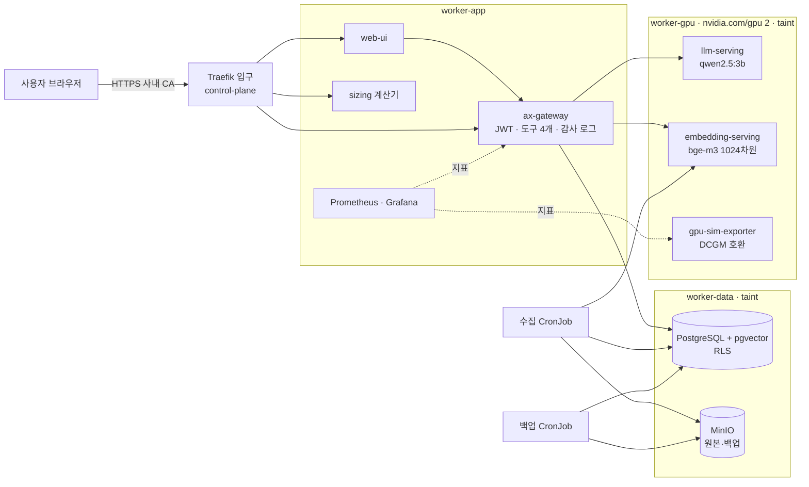

# AX Platform Lab

**권한 기반 사내 AI 플랫폼(sLLM + RAG + AI 에이전트)을 GPU 쿠버네티스에 구축하고, 운영(보안·폐쇄망·모니터링·백업·장애 대응)과 사이징까지 재현한 프로젝트**

가상 제조사 **한빛정밀**의 설비 매뉴얼·품질 보고서·정비 이력을 사내 AI가 답하되, **직원의 역할(작업자·정비원·품질·관리자)에 따라 볼 수 있는 문서만** 근거로 쓰게 했습니다. 모든 수치는 직접 측정한 값이고, 데이터는 전부 가상입니다.

📄 [프로젝트 소개 페이지](https://guraudrk.github.io/AIINFRA/) · 📘 [개념서](docs/textbook/) · 📝 [면접 노트](docs/study/) · ❓ [예상 질문 54개](docs/interview-qa-all.md)

---

## 왜 만들었나
에티버스그룹은 Dell AI Factory 기반 All-in-One AI 플랫폼(이테크시스템)과, **"기존 사용자 권한 기준으로 조회 범위를 제한"**하는 사내 AI 허브(AXhub)를 만들고 있습니다. 저는 제조기업 IT팀에서 ERP 계정·권한을 운영하며 **권한 요청 절차를 표준화**했던 경험이 있어서, "AI가 사내 문서를 읽을 때 권한을 어떻게 지키는가"를 인프라 엔지니어 관점에서 처음부터 끝까지 직접 만들어 보고 싶었습니다. 쿠버네티스, GPU, LLM 서빙, 벡터DB, Prometheus는 이번에 처음 깊게 다뤘습니다.

## 핵심 결과
| 영역 | 결과 | 근거 |
|---|---|---|
| 권한 통제 | **앱 필터 + PostgreSQL 행 수준 보안(RLS) 두 겹**. 앱 필터를 끈 배포에서도 품질 문서 유출 **0건** | [보안 사고 보고서](docs/incident-report-sample.md), 자동 테스트 14/14 |
| 폐쇄망 | 이미지·모델·설치 파일 7.5GB 번들로 **인터넷 차단 상태에서 15분 21초 만에 재구축** | [폐쇄망 절차서](docs/airgap-install.md) |
| 네트워크 보안 | 기본 거부 NetworkPolicy, 연결 테스트 적용 전 9개 열림 → **적용 후 14/14** | `scripts/netpol-test.sh` |
| 모니터링 | GPU(DCGM 호환)·TTFT·대기열 지표, 알람 11종. 부하 → 대기열 → TTFT 악화, 과열 → critical 알람 **실발생 확인** | [Grafana 화면](docs/images/m6-grafana-ai-platform.png) |
| 백업·복구 | 테이블 삭제 → 503 → 복구, **RTO 48초 / RPO 36초** | [복구 훈련 보고서](docs/restore-drill-report.md) |
| 장애 대응 | 장애 8종 주입, **4종은 고객 문의만 받고 직접 진단** | [런북 8개](runbooks/) |
| 사이징 | 32B FP8 · 동시 30건 = **70.6GB → L40S 2장**. KV 캐시가 가중치만큼 크다 | [기술 제안서](docs/proposal-sample.md), 계산기 `/sizing` |

## 아키텍처

- 노드를 역할별로 나누고 GPU·데이터 노드에는 허락받은 워크로드만 들어가도록 taint를 걸었습니다.
- Pod 간 통신은 **기본 거부**이고, 위 화살표에 해당하는 경로만 열려 있습니다.

## 같은 질문, 역할별로 다른 답
질문: **"3호기 E-203 대응 방법과 최근 정비 이력 알려줘"**
| 역할 | 받은 근거 문서 | 실행한 도구 | 거부 |
|---|---|---|---|
| 생산팀 작업자 | 안전 규정, 정비 요청 절차 | 문서 검색, **정비 요청서 초안** | 정비 이력 |
| 설비보전팀 정비원 | 3호기 매뉴얼(E-203, 특이사항) | 검색, 정비 이력 4건, 부품 재고(압력 센서 0개) | – |
| 품질팀 | 품질 불량 보고서 QR-2026-003 | 검색 | 정비 이력 |
| 공장 관리자 | 매뉴얼 + 품질 보고서 | 검색, 이력, 재고 | – |

근거 문서가 거리 기준(실측으로 정한 0.56)에 못 미치면 **LLM을 부르지 않고 "찾을 수 없습니다"**라고 답합니다. 출처는 LLM이 아니라 앱이 붙입니다.

## 모듈 요약
| 모듈 | 내용 | 결과 | 노트 |
|---|---|---|---|
| M0 | WSL2·Docker·GPU 점검 | 컨테이너 GPU 확인, VRAM 여유 3GB → 3B 모델 결정 | [00](docs/study/00-environment.md) |
| M1 | kind 4노드, Calico, GPU 노드 | taint·toleration·Pending 검증, GPU SIMULATED | [01](docs/study/01-cluster.md) |
| M2 | sLLM·임베딩 서빙 Helm 차트 | 동시 1/4/8 벤치(아래), 모델 적재 교착 진단·해결 | [02](docs/study/02-llm-serving.md) |
| M3 | 가상 데이터, pgvector, MinIO, 수집 | 문서 18 → 청크 138, 변경분 수집, MinIO 이미지 배포 중단 대응 | [03](docs/study/03-data-layer.md) |
| M4 | 권한 기반 RAG + 에이전트 | 2중 권한 통제, 하이브리드 검색, 자동 테스트 14/14 | [04](docs/study/04-rag-agent.md) |
| M5 | HTTPS 입구, NetworkPolicy, 폐쇄망 | ingress-nginx 은퇴 → Traefik, 14/14, 오프라인 15분 21초 | [05](docs/study/05-network-security.md) |
| M6 | Prometheus·Grafana·알람 | GPU·TTFT·대기열, 알람 실발생, CPU throttling 진단 | [06](docs/study/06-observability.md) |
| M7 | 백업·복구 훈련 | pg_dump → MinIO, RTO 48초 / RPO 36초 | [07](docs/study/07-backup.md) |
| M8 | 장애 대응 | 직접 진단 4종, 런북 8개, 보안 사고 보고서 | [08](docs/study/08-troubleshooting.md) |
| M9 | 사이징·기술 제안 | 계산기 + pytest, 가상 RFP 제안서 | [09](docs/study/09-sizing.md) |

## 측정 결과

**LLM 벤치마크** (CPU 추론, Ryzen 5 5600, qwen2.5:3b Q4_K_M, 동시 슬롯 4)
| 동시 요청 | TTFT p95 | 요청당 토큰/s | 총 처리량 토큰/s |
|---|---|---|---|
| 1 | 0.12s | 15.9 | 15.7 |
| 4 | 2.52s | 10.5 | **34.8** |
| 8 | **13.00s** | 9.2 | 36.3 |

→ 슬롯 수까지는 배치 효과로 처리량이 오르고, 넘으면 대기열 때문에 TTFT가 먼저 무너집니다.

**장애 시나리오** (`make chaos SCENARIO=N`)
| # | 장애 | 진단 근거 | 방식 |
|---|---|---|---|
| 1 | LLM 메모리 limit 축소 | OOMKilled / Exit 137 | 직접 진단 |
| 2 | 없는 모델 이름 | READY 0/1, readiness `model not found` | 직접 진단 |
| 3 | GPU 3개 요청 | Pending, `Insufficient nvidia.com/gpu` | 직접 진단 |
| 4 | DB Pod 삭제 | readyz 503 → 9초 뒤 자동 재연결 | 시연 |
| 5 | 임베딩 모델 교체 | `different vector dimensions 1024 and 768` | 시연 |
| 6 | 요청 폭주 | 대기열 5 > 4, TTFT p95 약 1분 | M6 실측 |
| 7 | 앱 권한 필터 비활성화 | 감사 로그 사용 문서 0건, RLS 차단 증명 | 직접 진단 |
| 8 | 테이블 삭제 | 백업 복구 RTO 48초 | M7 실측 |

## 빠른 시작
사전 준비: WSL2(Ubuntu) + Docker Desktop(WSL Integration ON), kubectl·kind·helm ([환경](docs/00-environment.md))
```bash
make up        # kind 4노드 + Calico + metrics-server + (SIMULATED) GPU 2개
make addons    # cert-manager(사내 CA) + Traefik(HTTPS 입구) + kube-prometheus-stack
make images    # 앱 이미지 빌드 + kind 노드 적재
make deploy    # Secret 생성 + ai-platform 차트 + 모델 사전 적재 (첫 실행 시 약 7GB 다운로드)
make ingest    # 가상 데이터 → MinIO → 청크·임베딩 → pgvector
make test      # 역할별 권한·RLS·감사 로그 자동 테스트 14개
```
- 채팅 `https://localhost/` · Grafana `https://localhost/grafana` · 사이징 `https://localhost/sizing` (사내 CA: `infra/tls/hanbit-root-ca.crt`)
- 비밀번호: `kubectl -n ai-platform get secret gateway-secrets -o jsonpath='{.data.demo-password}' | base64 -d`

```bash
./scripts/netpol-test.sh                 # NetworkPolicy 허용·차단 표
make chaos SCENARIO=1 / make chaos-revert SCENARIO=1   # 장애 훈련
make backup / CONFIRM=yes ./scripts/restore-drill.sh   # 백업 / 복구 훈련
./scripts/airgap-bundle.sh && FORCE=yes ./scripts/airgap-install.sh && ./scripts/airgap-verify.sh   # 폐쇄망 리허설
```

## 실제 환경과의 차이 (정직한 범위)
| 항목 | 이 프로젝트 | 실제 기업 환경 |
|---|---|---|
| GPU | 쿠버네티스에는 GPU 2개를 장부상 등록(SIMULATED), 추론은 CPU. 컨테이너 GPU 인식은 실제 RTX 4060으로 확인 | GPU Operator, 데이터센터 GPU, MIG |
| 클러스터 | kind 4노드(PC 1대), 컨트롤 플레인 1대 | OpenShift·RKE2, 컨트롤 플레인 3대 HA |
| 서빙 | Ollama. vLLM 옵션은 차트에 있으나 **동작 미검증** | vLLM·TensorRT-LLM |
| 폐쇄망 | 노드 iptables 차단, 이미지 직접 적재 | 물리 망분리, 내부 레지스트리 |
| 인증 | 데모 사용자 4명 + JWT | 사내 SSO, 원천 시스템 ACL 연동 |
| 백업 | pg_dump 일 1회, 일반 버킷 | 물리 백업 + PITR, 불변 저장소, 오프사이트 |
| 스토리지 | 노드 로컬 디스크(local-path) | CSI 외부 스토리지 |

## 배운 점
- **측정해야 결정할 수 있다.** 검색 거리 기준(0.56), 메모리 limit, Grafana CPU limit, GPU 대수 모두 감이 아니라 실측과 공식으로 정했고, 틀렸을 때도 수치로 원인을 찾았습니다.
- **보안은 두 겹이어야 한다.** 앱 필터 하나는 설정 실수 하나로 꺼집니다. DB가 마지막 방어선이 되도록 했고, 실제로 그 상황에서 유출이 없음을 감사 로그로 증명했습니다.
- **배포 성공 ≠ 서비스 정상.** 없는 모델 이름도, 원복했다고 생각한 설정도 "배포 성공"이었습니다. 배포 후 실제 값과 동작을 확인하는 습관을 들였습니다.
- **보안을 강화하면 다른 것이 깨질 수 있다.** RLS가 수집 배치를 깨뜨렸고, 그래서 쓰기 경로 회귀 테스트와 Job 실패 알람을 추가했습니다.
- **현장에서는 아무것도 받지 않는다.** 폐쇄망 리허설에서 해 보기 전에는 몰랐던 함정을 다섯 개 찾았습니다.
- 막힌 지점은 모두 노트의 "겪은 문제"에 진단 과정과 함께 남겼습니다.

## 저장소 구조
```
infra/          kind 설정, Traefik·모니터링 값, TLS(사내 CA), vendor(고정 설치 파일 + SHA256)
apps/           ax-gateway(FastAPI), web-ui(nginx), ingest(수집), sizing(계산기), gpu-sim-exporter
charts/         Helm 차트 ai-platform (서빙·DB·MinIO·게이트웨이·정책·모니터링·백업·사이징)
data/           가상 데이터 (한빛정밀 문서 18개, CSV 7종)
runbooks/       알람 대응 가이드, 장애 시나리오 런북 01~08
scripts/        운영 스크립트, chaos/ 장애 주입, airgap-* 폐쇄망
tests/          역할별 권한 자동 테스트
docs/           textbook/ 개념서, study/ 면접 노트, 절차서·보고서·제안서, images/
```
